<figure style="display: grid; grid-template-columns: 1fr 1fr; --media-width: 100%;">
<object data="demo.svg#light-system-2" type="image/svg+xml"></object>
<object data="demo.svg#light-dark-2" type="image/svg+xml"></object>
<object data="demo.svg#dark-system-2" type="image/svg+xml"></object>
<object data="demo.svg#dark-light-2" type="image/svg+xml"></object>
<figcaption style="grid-column: 1 / -1;">

A [good two-state toggle](#good-two-state-ux) can actually express all three data model states.
</figcaption>
</figure>

Until recently, if you looked at most websites with a theme toggle[^toggle], you'd find three options: **Light**, **Dark**, and **System**.

[^toggle]: Unless otherwise noted, this refers to a permanently visible toggle in the header or (rarely) footer, **not** a theme setting in a separate settings panel.

<figure class="multiple">

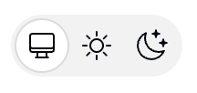

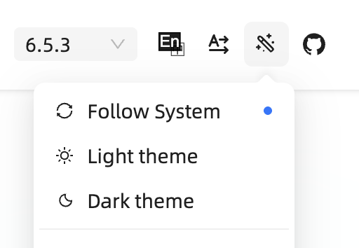
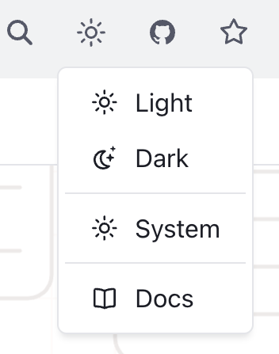{ style="flex: .7;" }
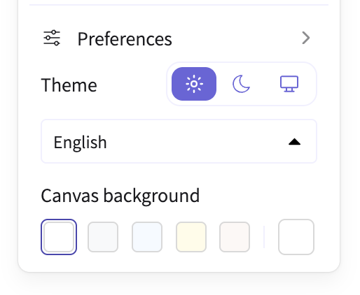
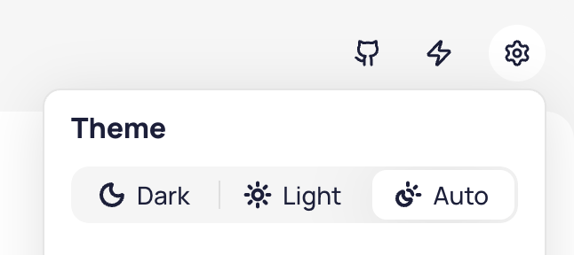{ style="flex: 1.2;" }
{ style="min-width: 100%;" }
{ style="min-width: 100%;" }

<figcaption>

Examples of tri-state dark mode toggles.
In (LTR) reading direction: Ant Design, Red Hat Design System, Web Awesome, Excalidraw, Taiga, Astro, Hero UI.
</figcaption>
</figure>

Thankfully, these days the trend has shifted towards a simpler two-state toggle, but tri-state ones are still incredibly common.

<figure id="two-mode-examples" class="multiple" style="--media-min-width: 5em">

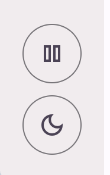{ style="flex: .07" }
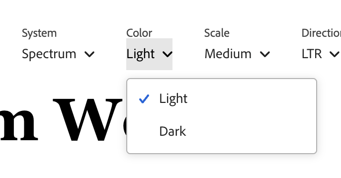
{ style="min-width: 100%;" }
{ style="min-width: 100%;" }

<figcaption>

Examples of two-state dark mode toggles.
In (LTR) reading direction: Vitepress, Material Design, Adobe Spectrum, Radix, ShadCN.
</figcaption>
</figure>

The rationale sounds plausible:
"System" is a different intent than "Light" or "Dark"!
One is a policy (*whatever my OS says, do that*)
The other is a value (*dark, forever, I don't care what my OS says.*)
Surely, users should be able to express that intent!

Except, real users don't generally seek out dark mode toggles to express intent for things to stay as they are, they seek them out when things need to change.

Think of the user goal when browsing a website (as opposed to a separate Settings page, where [three states are fine](#settings)).
E.g. on a documentation site, they may be there to look something up.
On a landing page, they may be trying to evaluate whether the product is suitable for their needs. 
On a media site, they may be there to read the news. 
On a graphics app, they want to draw something.

One thing is for certain: tweaking the theme is _not_ their primary goal [^developers].
To get in the mindset of tweaking the theme, _something needs to be off_.
When things look right, users just move on with their _actual_ goal instead of thinking about the theme.

[^developers]: This is about users. Yes, the developers of the site may have a goal of testing the theme, but we optimize UIs for being _used_, not getting debugged.

**The tri-state control is solving a largely imaginary user goal** that is extremely rare among real users, and does not justify the additional complication and UX friction of a three-state toggle.

Worse, it forces the user to decide between choices that produce no visible difference, breaking the principle of [feedback](https://www.nngroup.com/articles/ten-usability-heuristics/).

Yes, tri-state toggles are _common_.
[That doesn’t make them _good_](https://en.wikipedia.org/wiki/Argumentum_ad_populum).
This essay explains why, and how to do better.

<!-- more -->

## Tri-state toggles are implementation-driven UI

One of the most common UX mistakes is designing UI around the underlying data model instead of user goals.
**Good interfaces abstract away the underlying model and expose a model that aligns with user goals** (unless of course these happen to coincide, which is rare).

<figure style="align-items: end;">

<figcaption>
The user goal here is to set a specific flow and temperature.
The underlying model works with amounts of hot and cold water.
Guess which faucet is easier to use?
</figcaption>
</figure>

This is exactly the case with tri-state dark mode toggles; exposing all three states is data model leaking into the UI.

Yes, there should _absolutely_ be three states in the underlying implementation!
But at any given point, one of them is irrelevant to the end-user.

**Users cannot meaningfully express intent about problems they don't currently have.**

A dark mode toggle is a **temporary comfort adjustment**.
When it comes to user goals, there are only two real states:
1. The website looks ok. The user moves on with their actual goal and doesn't look for the toggle at all.
2. The website is too bright or too dark to be comfortable. The user wants to fix it.

You're reading in bed, the page is a flashbang, you hit the toggle.
You're on a laptop outside and the dark theme is unreadable in sunlight, you hit the toggle.
It's situational, it's immediate, and it's usually about the environment you're in rather than a considered long-term stance on color schemes.

A third state assumes a usage scenario where a user visits a website that looks perfectly fine, and still looks for a dark mode toggle to ensure it can continue to look fine in the future.
Users do all sorts of weird things, so I won't assert that this never happens, but it is not a natural user interaction, fueled by a real user goal.
Even the strongest proponents of tri-state toggles I have spoken with either admit they have never done this, or bring up some extremely rare, weird one-off edge cases.

<aside class="note">

I tried to ask on social media ([Bsky](https://bsky.app/profile/lea.verou.me/post/3msat5jppgk2n), [Twitter/X](https://x.com/LeaVerou/status/2084592593678008495), [Mastodon](https://front-end.social/@leaverou/117036981996311229), [GitHub](https://github.com/LeaVerou/blog/discussions/141)), but no matter how hard I tried to word it well, the question kept getting so misunderstood that the data is too noisy to be useful.

Besides people misunderstanding the question and talking about these times where they want to override the OS theme, there were also developers answering about debugging use cases (rather than their actual user behavior), or people talking about that one time they accidentally clicked that option.
There was even someone who concluded that because they want the site to inherit the OS setting almost always, they should vote "frequently"! 😵‍💫

That said, I don't think it matters all that much beyond academic curiosity, as a [good two state control](#good-two-state-ux) can actually express all three states — users just need to apply the override the first time it becomes relevant.

</aside>

## But what's the harm?

One could argue that sure, the third state is not frequently needed, but surely it doesn't hurt to have it there for the one user that will need it, right?

But a more complex UI has a cost.
It increases cognitive load for interacting with the control and  forces you towards certain UI design decisions.

A two-state toggle can be very compact: Just a single icon that switches to another when clicked.

Some websites do go that route with a tri-state toggle that cycles through three states. Docusaurus for example:

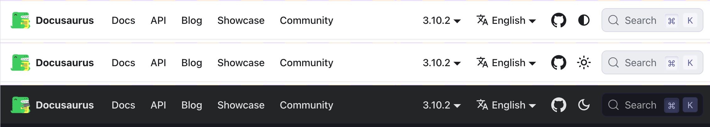

But generally, the ergonomics of that are poorer than for the two state toggle, so it is no surprise it's rare (Docusaurus was the only example I could find).

Some tri-state controls go for three icons side by side, which triples the screen real estate used.

<figure>

{ style="flex: 2.2" }

<figcaption>
Red Hat, Hero UI, Excalidraw, and Tailwind display three icons side by side.
</figcaption>
</figure>

Others, in an attempt to balance clarity and real estate, resort to a dropdown:

<figure class="multiple">

{ style="min-width: 100%;" }

<figcaption>
Ant Design, Web Awesome, and Taiga UI go this route.
Points for Web Awesome being the only one (!) to actually display what the system default resolves to.
</figcaption>
</figure>

That improves learnability, at the cost of efficiency, as it turns a single click interaction into a two-step process.

The actual _perceived friction_ is actually worse than one extra click.
Perceived friction is not a pure function of user actions, but also of the mental effort required to make a decision, and larger UI shifts (e.g. opening a dropdown) are more cognitively expensive than smaller ones (e.g. clicking a toggle) as the user needs to perceive and interpret a larger area.

## If not three states, then what? { #good-two-state-ux }

Guidance towards using tri-state controls is well meaning, but often based on paring good tri-state controls against poor two-state ones.
E.g. in [this article by Bramus](https://www.bram.us/2022/05/25/dark-mode-toggles-should-be-a-browser-feature/#the-problem-with-dark-mode-toggles):

> Above that many implementations I have seen don't take the "System" value into account. By omitting this option, the sites will never be able to respond to the system preference again, as they always have an override applied.

Indeed, a bad two state toggle is worse than a tri-state one.
It makes the system mode unreachable once tweaked, making the selection **irreversible** and violating the usability principle of [user control and freedom](https://www.nngroup.com/articles/ten-usability-heuristics/).
A good two-state should be able to express all three states.

The idea is that **the underlying model is still three states, but only two are shown at any given time**:

| Option | Shown as | Stored value |
|------|----------|--------------|
| System default | Current resolved value (e.g. sun or moon) | None |
| Override | Opposite of current resolved value (e.g. moon or sun) | `light` or `dark` |

When you press it for the first time, it toggles to the opposite of what you're currently seeing, and stores the literal value (`light` or `dark`).
The next time you press it, **it toggles back to the system default**, and removes the stored value.

That last bit is the one many two-state toggles get wrong.
Storing a value that happens to match the system preference silently converts a temporary adjustment into a permanent pin with no way out.

Another common mistake is being overzealous about removing the stored value when the system preference changes, even if the user has explicitly set an override.

**This evaluation must only happen at user interaction.**

This is important because many users have their OS set to automatically switch between light and dark mode based on time of day, and removing the stored value proactively would make it impossible for them to actually pin a theme.

If a stored override later happens to coincide with the system preference — because the OS changed, not because the user did anything — you **keep it**.

This looks like an oversight — they're the same now, why not tidy up?
Because tidying up silently downgrades an explicit choice into a default, based on an event the user didn't cause and can't see.

### Interactive demonstration

Here's a concrete scenario that you can navigate interactively ([view on separate page](demo.html)):

<theme-scenario src="demo.svg">

1. Your OS is in <strong data-value="start">light</strong> mode and the site has stored nothing, so the page follows along. Flip the OS control to run this the other way round. { data-editable="os" }
2. You toggle. The target is dark, which is _not_ what the OS says, so the site stores an override. **The page goes dark.** { data-action="page: !page" }
3. Your OS switches to dark. The override now matches it **but is still kept**. Nothing visibly happens, which is correct. { data-action="os: !os" }
4. Your OS switches back to light. **The page stays dark**, because the override is still active. { data-action="os: !os" }
5. You toggle. The target is light, which _is_ what the OS says, so the override is **removed**. The page follows the OS again. { data-action="page: !page" }
6. **Your turn.** Both controls are live and nothing from here on is scripted. Drive them in any order and watch what does — and does not — end up in `localStorage`. { data-editable }

</theme-scenario>

### But what if users get _confused_?

An argument I heard when discussing this was "but if the user selects light when their OS is light, then the OS switches to dark, won't they get confused that the website did not preserve their choice?"

People hypothesizing that _other_ people, who are not them, will get "confused" is a bit of a pet peeve of mine in usability discussions, but let's entertain it for a moment.

Here's that exact scenario:

<theme-scenario src="demo.svg" key="theme-pin">

1. Your OS is in <strong data-value="start">light</strong> mode and nothing is stored. { data-editable="os" }
2. You toggle to dark, which is stored as an override. { data-action="page: !page" }
3. You toggle again, meaning to _pin_ light. It matches the OS, so the override is **removed** — you actually got the system default. { data-action="page: !page" }
4. Your OS switches to dark and **the page follows**. Not what you meant! { data-action="os: !os" }
5. But the fix is a single click: light no longer matches the OS, so this time it _is_ an override, and thus pinned, so this can only happen at most **once**. { data-action="page: !page" data-editable="os" }

</theme-scenario>

Remember, this control is **entirely tangential** to the actual user goal for visiting the website.
Even if their intent were to pin _light_ instead of reverting to _System (light)_, this is something they would only notice once these diverge, i.e. the OS switches to dark.
At that point, fixing it is a single click away.
It's such an easy fix, that there is no point in dwelling on it further.

It's not that this never comes up, but making the tradeoff in favor of a tri-state control isn't justifiable, IMO.
A tri-state control introduces **permanent UI complexity** to prevent a **one-time, easily fixable problem**.

Additionally, [color appearance](https://en.wikipedia.org/wiki/Color_appearance_model) is not just a pure function of color components, but also affected by surroundings and other factors.
Even if a website implements only two modes, light mode may look slightly different in a light OS vs a dark OS, so selecting it as an override makes it an **informed decision**.

The title and icon _could_ make the state clearer (e.g. the tooltip saying "Switch back to light (system default)" instead of "Switch to light" or the icon having a small screen icon instead of just a sun or moon).
But those would need user testing to validate that they are an actual improvement.
My concern is that once you distinguish _System (light)_ from _light_, it (ironically) could _become_ the thing that primes users to seek a third state that they previously had not considered.

Even if there is an ingenious UI that exposes three states at the same time without adding any cognitive load or friction (I have some ideas about what that might look like), I’m unconvinced this is a problem worth solving, and feels a lot like the UX version of [premature optimization](https://en.wikipedia.org/wiki/Program_optimization#When_to_optimize).

## When is a tri-state control appropriate?

Although I spent the whole article arguing against tri-state toggles, there _are_ actually valid use cases for them.

These are the two cases I’m aware of, but feel free to recommend more in the comments!

### 1. Color scheme setting that lives a separate settings panel { #settings }

This article is primarily geared towards a **permanently visible toggle in the header or footer**.

A setting that lives alongside other settings in a settings panel is a fundamentally different usage scenario:
- The user is already in the mode of making decisions about their future
- The expectation is not that every setting must produce immediate feedback
- There is a lot more screen real estate to explain three states.

It is no accident that while 2-state toggles are becoming the norm for persistent controls, tri-state is (rightly) king for settings panels.

<figure>

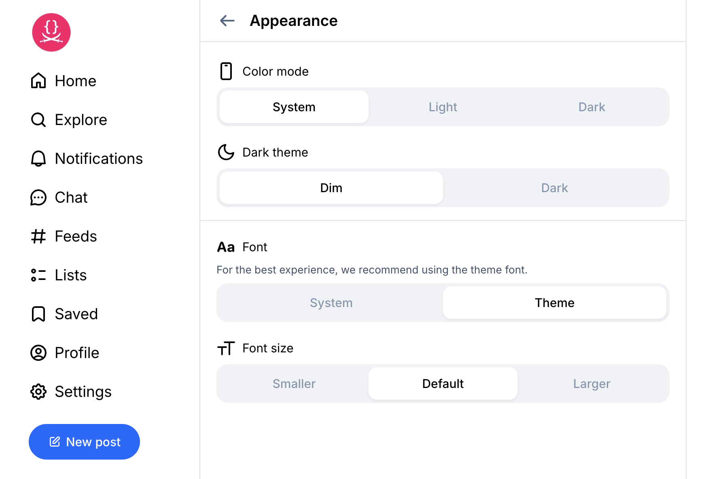

<figcaption>

Bluesky's Appearance settings panel.
The tri-state is fine here.
Showing the "Dark mode" option below even when it produces no effect, on the other hand…
</figcaption>
</figure>

<figure>

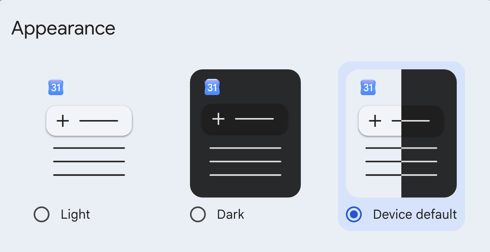

<figcaption>

Google Calendar. Love the icons, it would be nice to actually indicate what System currently resolves to.
</figcaption>
</figure>

<figure>

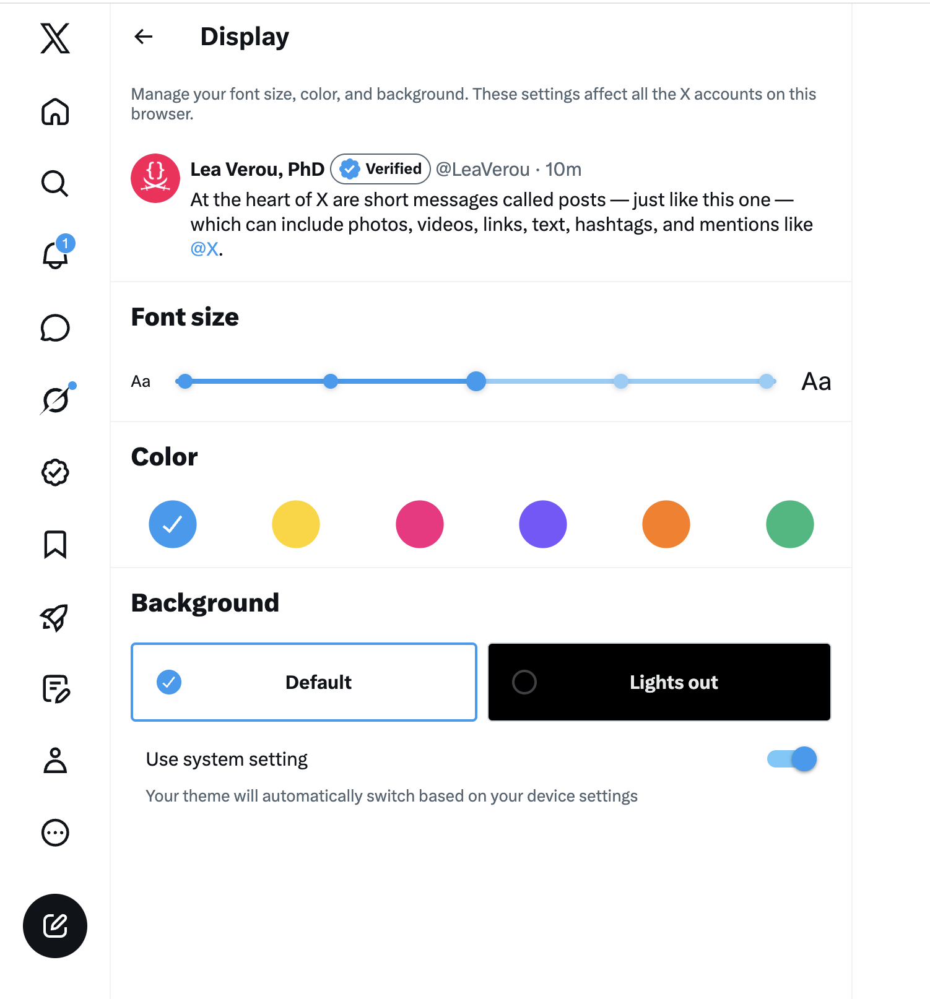

<figcaption>

I’m not one to praise post-X Twitter, but having two two-state toggles instead of one tri-state is a very interesting design choice.
The UX is not quite there, but if done well, I think it could be the best of both worlds when you have the screen real estate.
</figcaption>
</figure>

### 2. When color schemes are implemented differently depending on the system setting { #four-themes }

This entire essay assumes the common case where a website only has two color schemes: light and dark, and there is no difference between light mode in a dark OS vs light mode in a light OS.
[Vadim Makeev had an interesting idea](https://blog.kizu.dev/querying-the-color-scheme/#not-the-user-preference):
color schemes should take the underlying OS setting into account.
Light mode should be less bright in a dark OS and dark mode should be less dark in a light OS, to reduce the contrast between the website and the rest of the system.

I have not seen many UIs doing this, and CSS does not make it easier (`light-dark()` is very much designed around duality), but if you are actually doing this, you have earned your three states my friend, display them as prominently as you like, none of this applies to you!

## The general version

The dark mode toggle is a nice case study, but the underlying lesson is bigger:

**Users do not seek out solutions to problems they don't currently have.**

The tri-state toggle is the GUI version of [low signal-to-noise APIs](https://lea.verou.me/blog/2025/user-effort/#signal-to-noise) that ask you to pass dozens of parameters that could have sensible defaults, forcing you to decide on problems you have not encountered and are not relevant.

Do not flood users with options that are irrelevant to their current situation.
Options that _might_ become relevant in the future, should be surfaced in that future, not pre-emptively.

Not every state of your state machine warrants visible UI.

Ultimately, everything boils down to the very same principle: 
[**Respect user effort.**](https://lea.verou.me/blog/2025/user-effort/)

_Thanks to Chris Lilley and Jake Archibald for reviewing an earlier version of this draft_
